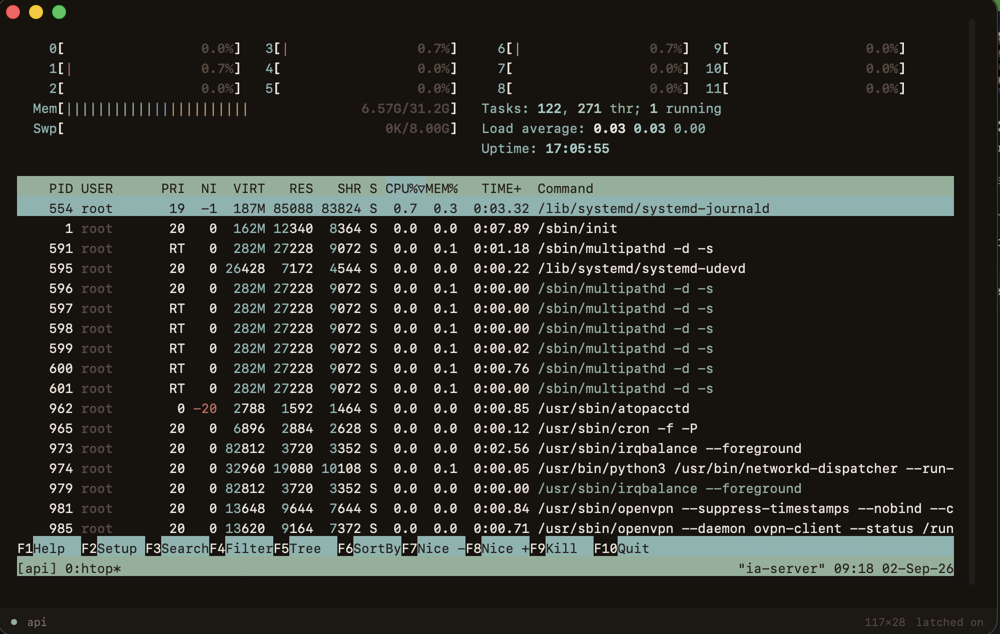

<h1 align="center">Latch</h1>
<p align="center"><em>Your sessions, still running.</em></p>

Latch est un gestionnaire de sessions distantes pour macOS. Un clic sur une
session ouvre un terminal attaché à une session `tmux` sur un serveur, quel que
soit l'état de la connexion précédente. Vous fermez le Mac, vous le rouvrez le
lendemain, la session est là où vous l'aviez laissée.



## État

**v0.2** — c'est une app. Raccourcis persistés en JSON, barre latérale, onglets,
écran du builder, et la sonde serveur du §6 avec sa cascade de dégradation.
Reste pour la v0.3 : le binaire mosh embarqué, la reconnexion au réveil et les
hooks Claude Code. Voir la [feuille de route](SPEC.md#12-feuille-de-route).

## Ce que fait Latch

Un clic sur une session dans la barre latérale ouvre un onglet attaché à
`tmux new -A -s <session>` sur le serveur. `-A` attache si la session existe et
la crée sinon : il n'y a nulle part de logique « la session existe-t-elle ? »,
et c'est ce qui rend la reconnexion triviale.

### La commande est construite, pas devinée

L'écran du builder empile des étapes — pré-vol local, connexion, fenêtres tmux —
et affiche en bas la commande générée, **éditable**. La modifier bascule le
raccourci en mode personnalisé, avec un bouton pour revenir au mode assisté.

```bash
ssh -t billy "tmux new -A -s api -c ~/api 'claude --continue; exec \$SHELL'"
mosh billy -- tmux new -A -s dev
tmux new -A -s notes -c ~/notes
```

L'échappement est la partie fragile, et elle est testée en faisant réellement
traverser un `/bin/sh` aux commandes produites, avec de faux `tmux`, `ssh` et
`mosh` qui impriment les arguments reçus.

### Le serveur est sondé, jamais modifié

À la première connexion à un hôte, un aller-retour unique relève `tmux`,
`mosh-server`, `claude` et l'identifiant de la distribution. Le résultat est mis
en cache sept jours.

| État du serveur | Ce que fait Latch |
|---|---|
| tmux + mosh | commande nominale |
| tmux seul | bascule sur `ssh -t`, bandeau non bloquant proposant mosh |
| aucun des deux | `ssh -t` sur un shell nu, bandeau signalant que la session ne survivra pas |

**La connexion réussit toujours, même dégradée.** Le bandeau est cliquable et
ouvre un panneau qui affiche le diagnostic, la conséquence en une phrase, et la
commande d'installation exacte construite depuis `/etc/os-release` :

| `ID` détecté | Commande proposée |
|---|---|
| `debian` `ubuntu` `raspbian` `linuxmint` `pop` | `sudo apt install -y …` |
| `fedora` `rhel` `centos` `rocky` `almalinux` | `sudo dnf install -y …` |
| `arch` `manjaro` `endeavouros` | `sudo pacman -S --noconfirm …` |
| `alpine` | `sudo apk add …` |
| `opensuse*` `sles` | `sudo zypper install -y …` |
| `freebsd` | `sudo pkg install -y …` |
| inconnu | aucune commande — les paquets requis, un lien, et un champ libre |

Seuls les paquets réellement manquants y figurent. Claude Code a sa propre
ligne, **sans `sudo`** : son installeur officiel refuse de tourner sous sudo et
installe dans `$HOME/.local/bin`.

Latch n'exécute rien de tout ça. Le bouton par défaut est `Copier` ; l'autre
ouvre un onglet sur l'hôte et y **écrit** la commande sans appuyer sur Entrée,
pour que le mot de passe `sudo` soit tapé dans un vrai TTY. Aucun `sudo -S`,
aucun `sshpass`, aucune installation silencieuse.

## Prérequis

- macOS 14 ou plus récent
- Xcode 16 ou plus récent, avec la chaîne d'outils Metal
  (`xcodebuild -downloadComponent MetalToolchain`) — SwiftTerm embarque un
  shader Metal, et depuis Xcode 26 ce composant se télécharge à part
- [XcodeGen](https://github.com/yonaskolb/XcodeGen) : `brew install xcodegen`
- Côté serveur : `tmux`. `mosh` en plus si vous voulez que la session survive
  à une mise en veille sans se reconnecter.

Rien à installer côté Mac pour tmux : tmux ne tourne que sur le serveur.

## Construire

```bash
xcodegen generate
xcodebuild -project Latch.xcodeproj -scheme Latch \
           -destination 'platform=macOS' \
           -skipPackagePluginValidation build
```

Le `.xcodeproj` n'est pas versionné : il est régénéré depuis `project.yml`.

### Tests

```bash
xcodebuild -project Latch.xcodeproj -scheme Latch \
           -destination 'platform=macOS' \
           -skipPackagePluginValidation test
```

## Premier lancement

Deux autorisations macOS peuvent se mettre en travers, et elles ne se voient
qu'au lancement depuis le Finder — depuis un terminal, l'app hérite de celles
du terminal :

- **Réseau local** (Réglages → Confidentialité et sécurité → Réseau local).
  Sans elle, un serveur du LAN est injoignable et Latch affiche
  `ssh: connect to host 192.168.1.37 port 22: No route to host`. macOS propose
  la demande au premier lancement ; si elle a été refusée, il faut la
  réactiver à la main.
- **Signature**. Latch est signée localement pendant le développement. Un `.app`
  téléchargé et non notarisé demande un clic droit → **Ouvrir** au premier
  lancement.

## Configuration

Les raccourcis vivent dans
`~/Library/Application Support/app.latch.Latch/shortcuts.json`.
**Ce fichier ne contient jamais de secret** : l'authentification se fait par
clé, et Latch ne stocke aucun mot de passe.

Au premier lancement, la barre latérale se remplit avec les alias `Host` de
`~/.ssh/config`. Ajoutez-y l'entrée correspondant à votre serveur :

```
Host billy
    HostName 192.168.1.37
    User billy
    IdentityFile ~/.ssh/id_ed25519
```

L'authentification se fait **par clé uniquement**. Latch ne stocke aucun mot de
passe et ne lit jamais celui que vous tapez dans le terminal.

`TERM` est imposé à `xterm-256color` — ce que SwiftTerm émule réellement — et
jamais hérité du terminal d'où Latch a été lancée. Sans cela, une app démarrée
depuis Ghostty enverrait `TERM=xterm-ghostty` à un serveur qui n'a pas ce
terminfo, et le tmux distant refuserait de démarrer sur
`missing or unsuitable terminal`.

### Sur l'adresse du serveur

L'IP d'un serveur de maison est souvent attribuée par DHCP et change. Trois
façons de ne pas avoir à modifier `~/.ssh/config` tous les mois, de la plus
simple à la plus solide :

1. réserver l'adresse dans le routeur, par adresse MAC ;
2. utiliser le nom mDNS de la machine, `billy.local`, valable sur le réseau
   local ;
3. installer [Tailscale](https://tailscale.com), qui donne un nom stable et
   fonctionne aussi hors du réseau local.

## Architecture

Quatre couches, strictement séparées — aucune ne connaît celle du dessus :

| Couche | Rôle | État |
|---|---|---|
| `SessionStore` | état, persistance JSON, trousseau | ✅ |
| `CommandBuilder` | modèle → chaîne de commande | ✅ |
| `ConnectionDriver` | lance un binaire dans un PTY | v0.3 |
| `PTYProcess` | `forkpty(3)`, octets, `SIGWINCH`, fin de vie | ✅ |
| `TerminalPane` | SwiftTerm branché sur le flux | ✅ |

## Dépendances

- [SwiftTerm](https://github.com/migueldeicaza/SwiftTerm) 1.20.0 (MIT) — le seul
  émulateur de terminal embarqué. Il tire lui-même `swift-argument-parser`.

Le binaire `mosh-client` sera embarqué dans le bundle en v0.3, pour ne pas
exiger Homebrew de l'utilisateur ; sa version exacte sera notée ici, mosh étant
sensible aux écarts entre client et serveur.

## Distribution

Les binaires publiés seront signés et notarisés, ce qui exige un compte
développeur Apple (99 €/an). Sans notarisation, le premier lancement d'un `.app`
téléchargé demande un clic droit → **Ouvrir** au lieu d'un double-clic.

## Licence

MIT — voir [LICENSE](LICENSE).
